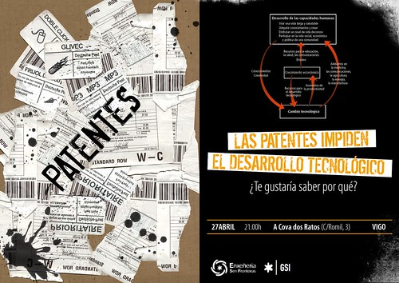

---
categories:
  - General
date: 2007-04-23
permalink: /propuesta-para-el-viernes-noche/10/
slug: propuesta-para-el-viernes-noche
---

# Propuesta para el viernes noche

Hace un par de semanas [Andrés](https://oandre.gal/) comentaba sus [impresiones](https://oandre.gal/conecemento-aberto-e-desenvolvemento-sensacions-das-xornadas/) acerca de la charla sobre conocimiento abierto y desarrollo que preparamos entre los dos.

No es mi intención en este momento hacer valoraciones sobre la experiencia, que las haré, sino aprovechar esta tribuna para invitar a todo aquel que me lea a disfrutarla en vivo y en directo.

<!-- prettier-ignore-start -->

- **Conocimiento Abierto y Desarrollo**

      ---

      Viernes, 27 de Abril a las 21:00

      [:octicons-arrow-right-24: Caleidoskopio. Romil Nº3. Vigo](http://www.google.com/maps?f=q&hl=es&q=vigo+caleidoskopio&sll=37.0625,-95.677068&sspn=61.669968,108.28125&layer=&ie=UTF8&ei=jAotRr-MOpqo3AKy4YiWBw&cid=42233168,-8729728,16062093567350814503&li=lmd&z=14&t=m)

  

  <!-- prettier-ignore-end -->

Para los que no podais asistir pero tengáis interés hemos colgado la presentación en internet, está en gallego, pero se entiende muy facilmente. Lo importante de este tipo de iniciativas es que se inicie un diálogo del que ambas partes, ponente y oyentes obtengan un aprendizaje, así que os animo a que dejéis vuestras impresiones o sugerencias en los comentarios.
