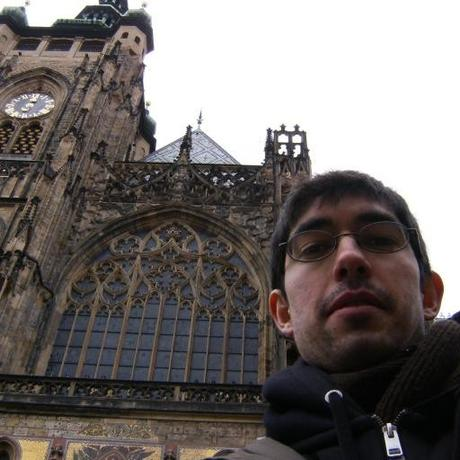

{ class=crop-left-mug }

Fran tiene una visión interdisciplinar que abarca desde la perspectiva tecnológica hasta la social.

Desarrollador de Software por profesión, ha colaborado activamente en ONG relacionadas con la tecnología, el desarrollo humano y el software libre. Esta experiencia le ha permitido desarrollar una comprensión profunda sobre las interacciones entre la tecnología y la sociedad.

Puedes encontrarlo en:

-   [:fontawesome-brands-github: GitHub](https://github.com/fpuga) - parte de mi trabajo, charlas y escritos está aquí.
-   [:fontawesome-brands-linkedin: LinkedIn](hhttps://www.linkedin.com/in/francisco-puga-b25a8361/) - para contacto comercial.
-   [:fontawesome-brands-x-twitter: Twitter/X](https://x.com/fpuga) - escribo poco, sobre todo para seguir a gente.
-   [:fontawesome-brands-stack-overflow: StackOverflow](https://stackoverflow.com/users/930271/francisco-puga) - activo en un par de etiquetas.
